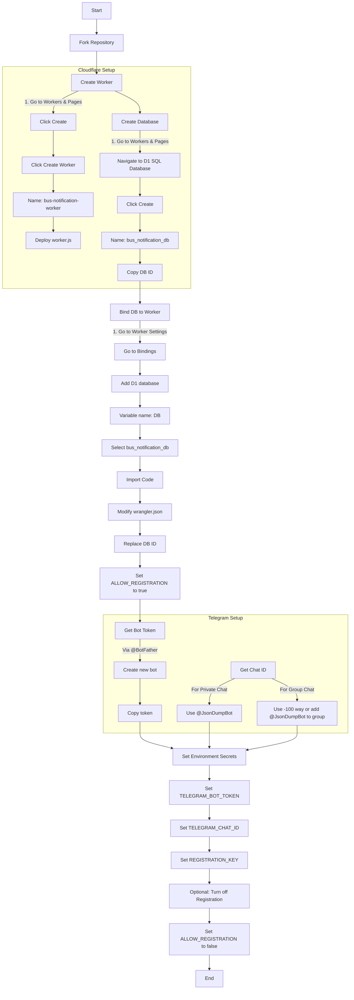

# Bus Notification Worker

## Setup

To set up this worker on your own Cloudflare account and Telegram bot, you need to do the following steps:

### Fork

1. Fork this repository.
2. You can change the visibility to **private** if needed.

### Create Worker

1. Open your [Cloudflare dashboard](https://dash.cloudflare.com/) and navigate to **Workers & Pages**.
2. Click **Create** below the title.
3. Click **Create Worker**
4. Rename the worker to `bus-notification-worker`.
5. Click **Deploy** below the code block (worker.js).

### Create DB

1. Open your [Cloudflare dashboard](https://dash.cloudflare.com/) and navigate to **Workers & Pages**.
2. Navigate to **D1 SQL Database** under **Storage & Databases**.
3. Click **Create**.
4. Type `bus_notification_db` in the field with the placeholder **Name**.
5. Click Create.
6. Copy the ID.

### Bind DB to Worker

1. Open your [Cloudflare dashboard](https://dash.cloudflare.com/) and navigate to **Workers & Pages**.
2. Open the created worker and navigate to **Settings**.
3. Go to **Bindings** section.
4. Click **Add** and choose **D1 database**.
5. Type `DB` in the **variable name**.
6. Select `bus_notification_db` in the dropdown menu.

> [!NOTE]
> If you want to set another name, the variable name should be JavaScript syntax-valid, meaning that it should not contain spaces, hyphens, or other illegal characters.

7. Click **Deploy**.

### Import code

1. Open your [Cloudflare dashboard](https://dash.cloudflare.com/) and navigate to **Workers & Pages**.
2. Open the created worker and navigate to **Settings**.
3. Go to **Build** section.
4. Link the forked repository to your Cloudflare account.

### Modify wrangler.json

1. Open wrangler.json.
2. Replace the ID with your own ID copied when you create the DB.
3. Change the variable **ALLOW_REGISTRATION** to `true` to turn on this option.
4. Commit the changes to **main** branch of the forked repository.

> [!TIP]
> Doing this after linking your GitHub account ensures that changes are observed by Cloudflare so the code is in sync with the repository.

### Get bot token

1. Open Telegram and search **@BotFather**.
2. Send `/newbot` to create a bot and copy the token, or copy the token of the bot you’ve created.

### Get chat id

#### For Private Chat

1. Navigate to the chat room with you and the bot.
2. Click **Start** for new bot or send a message for old one
3. Search **@JsonDumpBot**.

> [!NOTE]
> [@nadam/jsondumpbot](https://github.com/nadam/jsondumpbot) is an open source project available on GitHub.
  
4. Forward the message sent to the bot to **@JsonDumpBot**.
5. Copy the chat id at `message.chat.id` in the json.

#### For Group Chat (Method 1)

1. Send a message on behalf of yourself.
2. Copy the link of this sent message in the format `https://t.me/<chat_id>/<message_number>`.
3. Prepend `-100` to the `<chat_id>`. (Not add!) For example, `-100<chat_id>`.
4. `-100<chat_id>` is the chat id used with Telegram Bot API.

#### For Group Chat (Method 2)

1. Add **@JsonDumpBot** to the target group.
2. Send a message and wait for response from the bot.
3. Copy the chat id at `message.chat.id` in the json.

> [!TIP]
> You may remove **@JsonDumpBot** after using because it is designed to export or dump JSON for every message, meaning it will send a lot of messages when chatting.

### Issue Registration key

1. To prevent unknown users from registering as clients, you should set a complex, random password and keep it secure and private.
2. Although the registration key can be any string, however, **it’s strongly recommended to set a safe password** even you can turn off allow registration later.

### Set Environment Secrets

1. Open your [Cloudflare dashboard](https://dash.cloudflare.com/) and navigate to **Workers & Pages**.
2. Open the created worker and navigate to **Settings**.
3. Go to **Variables and Secrets** section.

> [!CAUTION]
> This is different from **Variables and secrets** in **Build** section. This one is for the worker, and the other is for build process.

4. Add the following secrets:

    | Variable name | Value |
    | --- | --- |
    | TELEGRAM_BOT_TOKEN | The token you get in **Get bot token** section. |
    | TELEGRAM_CHAT_ID | The chat id you get in **Get chat id** section. |
    | REGISTRATION_KEY | The registration key you issues in **Issue Registration key** section. |

### Get API (Provider)

1. Open your [Cloudflare dashboard](https://dash.cloudflare.com/) and navigate to **Workers & Pages**.
2. Open the created worker and navigate to **Settings**.
3. Go to **Domains & Routes** section.
4. Ensure that the **workers.dev** type is enabled.
5. Copy the value in the format `bus-notification-worker.<username>.workers.dev`.

### Register

1. Open **Bus**

> [!NOTE]
> [@EricHsia7/bus](https://github.com/EricHsia7/bus) is an open source project available on GitHub.

2. Click the **Settings** button at the top-left corner.
3. Go to **Notification** section.
4. Paste your API (Provider) and Registration key.
5. Click the button with a check mark at the top-right corner.

> [!NOTE]
> If you reopen the notification page, you will see the registration key field are empty for security purposes. It is normal and doesn’t affect your registration status as well as your usage.

### Turn off Allow registration

> [!NOTE]
> Allow registration is turned on previously in Modify wrangler.json section.

> [!TIP]
> If you want to use this on multiple devices or browsers, you can do this later.

> [!CAUTION]
> Turning of **allow registration** can add an extra layer of security ***if your Cloudflare account isn’t compromised***.

1. Open wrangler.json.
2. Change the variable **ALLOW_REGISTRATION** to `false`.

## Setup Flowchart

